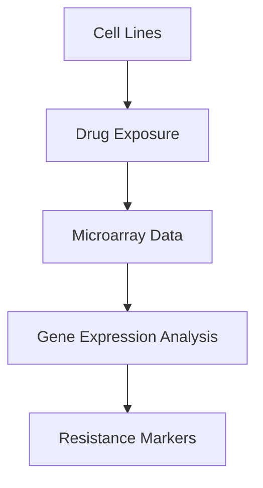

  <h1>🧬 Cancer Cell Line Drug Resistance Analysis</h1>
  

    Welcome to my final academic project for the <strong>Advanced Diploma in Biotechnology</strong>. 
    This work focuses on analyzing gene expression data from breast cancer cell lines that developed resistance to chemotherapeutic drugs.
  

  

  <h2>🧠 Project Overview</h2>
  
Two MCF-7 breast adenocarcinoma cell lines were exposed to increasing doses of:

  <ul>
    <li><strong>Paclitaxel (Taxol™)</strong></li>
    <li><strong>Doxorubicin (Adriamycin™)</strong></li>
  </ul>
  
<strong>Research Goal:</strong> Identify genes associated with drug resistance through microarray analysis of six escalating drug doses (Doses 7–12).

 
 <h2>💼 Skills Demonstrated</h2> <ul> <li>🔬 <strong>Genomics:</strong> Microarray analysis (TMEV)</li> <li>📊 <strong>Bioinformatics:</strong> Differential expression workflows</li> <li>🧠 <strong>Functional Analysis:</strong> GeneCards interpretation</li> <li>📝 <strong>Reporting:</strong> Scientific visualization & writing</li> </ul> 
 
 <h2>📈 Key Findings</h2> 
<strong>Paclitaxel Resistance</strong>
 Upregulated: ABCB1 TUBB3  Downregulated: CDKN1A 
<strong>Doxorubicin Resistance</strong>
 Upregulated: TOP2A GSTM1  Downregulated: TP53 
<strong>Biological Implications:</strong>  Drug efflux transporters · Microtubule remodeling · Oxidative stress defense · Apoptosis resistance pathways
 
 
 <h2>📁 Project Resources</h2> <ul> <li>📄 <a href="analysis_report">Full Analysis Report</a></li> <li>📊 <a href="figures/volcano_plot.png">Interactive Visualizations</a></li> <li>🧬 Raw Data Files (see <code>/data</code> folder)</li> <li>📚 <a href="references.md">Literature References</a></li> </ul> 
 
 <h2>🧑‍🔬 Contact</h2> 
 <strong>Noah Olaobaju</strong>  Biotechnology Graduate | Cancer Research Enthusiast   📫 <a href="mailto:olaobajun@yahoo.com">olaobajun@yahoo.com</a>  🔗 <a href="https://www.linkedin.com/in/your-linkedin">LinkedIn</a>  🐙 <a href="https://github.com/yourusername">GitHub</a> 
 
 <footer style="text-align: center; margin-top: 30px; color: #666;"> © 2025 Noah Olaobaju | MCF-7 Drug Resistance Project </footer> 
